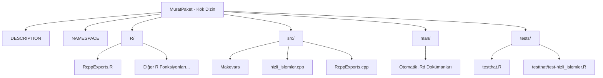

# Rcpp ile C++ Tabanlı Yüksek Performanslı R Paketi Geliştirme Rehberi

Bu rehber, C++ kullanarak yüksek performanslı bir R paketi yazmak, belgelendirmek, test etmek ve dünya çapındaki R geliştiricileriyle paylaşmak (GitHub ve CRAN üzerinden) için gereken tüm adımları içermektedir.

---

## 1. Proje Mimarisi ve Paket Yapısı

R + C++ paketlerinin temel yapısı standart bir R paketine benzer ancak `src/` klasörü altında C++ kaynak kodlarını barındırır:



### Önemli Dosyalar
- **`DESCRIPTION`**: Paketin adı, sürümü, yazarı, lisansı ve bağımlılıklarını (`Imports`, `LinkingTo`) tanımlar.
- **`NAMESPACE`**: R'ın paketteki hangi fonksiyonları dışarıya açacağını (export) ve dışarıdan hangi fonksiyonları alacağını (import) belirtir.
- **`src/Makevars`**: C++ derleyicisine özel parametreler (örneğin OpenMP ile çoklu çekirdek desteği) iletmek için kullanılır.
- **`RcppExports.cpp` ve `RcppExports.R`**: Rcpp tarafından C++ fonksiyonlarını R tarafına bağlamak için otomatik olarak üretilir. **Manuel olarak düzenlenmemelidir.**

---

## 2. Yüksek Performanslı C++ Fonksiyonları

Paketimize eklediğimiz üç temel yüksek performanslı fonksiyonun mimarisi aşağıda açıklanmıştır. Kodlar [hizli_islemler.cpp](file:///mnt/e/GARAGE/HEIDELBERG/MuratPaket/src/hizli_islemler.cpp) dosyasında yer almaktadır.

### A. Paralel Mesafe Matrisi (`paralelUzaklikC`)
R'ın varsayılan `dist()` fonksiyonu büyük matrislerde yavaş kalabilir. Yazdığımız fonksiyon, **OpenMP** kullanarak hesaplamayı tüm CPU çekirdeklerine dağıtır.

> [!TIP]
> **Önbellek (Cache) Dostu Tasarım:** R matrisleri sütun-öncelikli (column-major) saklandığı için, paralel döngü dıştaki sütun (`j`) döngüsü üzerinden kurulmuştur. Bu sayede her iş parçacığı (thread) hafızadaki ardışık alanlara yazarak bellek bant genişliğini en verimli şekilde kullanır.

### B. Hareketli Ortalama (`hareketliOrtalamaC`)
Zaman serisi analizlerinde sıkça kullanılan rolling mean işlemi, C++'ta **Sliding Window (Kayan Pencere)** algoritması ile $O(N)$ zaman karmaşıklığında çalışır. Her adımda tüm pencereyi yeniden toplamak yerine, sadece pencereye yeni giren elemanı ekleyip çıkan elemanı çıkarır.

### C. Hızlı Grup Ortalaması (`grupOzetC`)
Büyük verilerde gruplama ve özetleme işlemleri için C++ standart kütüphanesindeki `std::unordered_map` (Hash Map) kullanılmıştır. R tarafındaki `aggregate` fonksiyonuna kıyasla kat kat daha hızlı sonuç üretir.

---

## 3. Geliştirme Döngüsü ve İş Akışı

Paketi geliştirirken sürekli olarak izleyeceğiniz döngü şöyledir:

```mermaid
sequenceDiagram
    participant C++ as C++ Kodları (src/)
    participant Rcpp as Rcpp::compileAttributes()
    participant R as R CMD INSTALL / Roxygen
    participant Test as testthat::test_local()
    
    Note over C++: C++ dosyalarında değişiklik yapın veya yeni fonksiyon ekleyin.
    C++ ->> Rcpp: Rcpp::compileAttributes() çalıştırın.
    Note over Rcpp: RcppExports.cpp ve RcppExports.R güncellenir.
    Rcpp ->> R: Paketi derleyin ve kurun (R CMD INSTALL).
    R ->> Test: Testleri çalıştırın ve doğrulayın.
```

### Temel Komutlar (Terminal veya R Konsolu)

1. **C++ Arayüzlerini Güncelleme:**
   Yeni bir `// [[Rcpp::export]]` eklediğinizde R konsolunda şunu çalıştırın:
   ```R
   Rcpp::compileAttributes()
   ```

2. **Dokümantasyon Üretme (Roxygen2):**
   C++ kodlarındaki `#' @export` ve `#' @param` gibi etiketlerden `.Rd` dosyalarını ve `NAMESPACE` içeriğini üretmek için:
   ```R
   roxygen2::roxygenise()
   # Veya devtools yüklüyse:
   devtools::document()
   ```

3. **Paketi Derleme ve Yerel Olarak Kurma:**
   ```bash
   R CMD INSTALL .
   # Veya devtools yüklüyse:
   devtools::install()
   ```

4. **Testleri Çalıştırma:**
   ```R
   testthat::test_local()
   # Veya
   devtools::test()
   ```

---

## 4. Birim Testleri (Unit Tests)

Paketin kararlılığı için [test-hizli_islemler.R](file:///mnt/e/GARAGE/HEIDELBERG/MuratPaket/tests/testthat/test-hizli_islemler.R) dosyasında yazdığımız testler büyük önem taşır. C++ kodu doğrudan bellek yönetimi yaptığı için hatalı bir indis erişimi tüm R oturumunun çökmesine (Segmentation Fault) sebep olabilir. 

> [!IMPORTANT]
> C++ fonksiyonlarınızı R'a sunmadan önce sınır değerleri (boş vektörler, negatif girdiler, `NA` değerleri) içeren senaryolarla test etmeyi asla ihmal etmeyin.

---

## 5. Paketi Yayınlama Süreci

Yazdığınız paketi diğer insanların kullanabilmesi için iki temel yöntem vardır:

### A. GitHub Üzerinden Yayınlama (Kolay ve Yaygın)
Paketinizi bir GitHub deposuna yüklediğinizde, kullanıcılar paketi R içerisinden tek bir komutla kurabilirler:

```R
# Kullanıcıların kurma yöntemi:
install.packages("devtools") # veya "remotes"
devtools::install_github("kullanici_adiniz/MuratPaket")
```

**Adımlar:**
1. Proje dizininde git deposu başlatın: `git init`
2. `.gitignore` dosyasına derleme çıktılarını ekleyin (`src/*.o`, `src/*.so`, `src/*.dll`, `.Rproj.user/` vb.).
3. Kodlarınızı GitHub'a yükleyin.

### B. CRAN (Comprehensive R Archive Network) Üzerinden Yayınlama (Resmi ve Prestijli)
CRAN, R dünyasının resmi paket havuzudur. Buraya paket kabul edilme süreci oldukça sıkıdır ve otomatik testlerden geçmesi gerekir.

**CRAN Öncesi Kontrol Listesi:**
1. **R CMD check**: Paketinizin CRAN standartlarına uygunluğunu denetlemek için terminalde şu komutu çalıştırın:
   ```bash
   R CMD check --as-cran .
   ```
   *Bu komutun sıfır **Hata (Error)** ve sıfır **Uyarı (Warning)** vermesi şarttır. Notlar (Notes) da mümkün olduğunca temizlenmelidir.*
2. **Tüm Platformlarda Test Etme**: Paketin Windows, macOS ve farklı Linux sürümlerinde derlendiğinden emin olmak için `rhub` paketini veya GitHub Actions entegrasyonunu kullanabilirsiniz.
3. **Dokümantasyon Eksiksizliği**: Tüm parametrelerin tanımlanmış olması ve her fonksiyonun çalışabilir bir `#' @examples` bloğuna sahip olması gerekir.
4. **Lisans**: `DESCRIPTION` dosyasında geçerli bir açık kaynak lisansı (örn: MIT, GPL-3) açıkça belirtilmelidir.

> [!WARNING]
> CRAN politikalarına göre C++ kodunuzda doğrudan `std::cout` veya `printf` kullanmamalısınız; bunun yerine R'ın çıktı akışını yönlendiren `Rcpp::Rcout` kullanmalısınız. Aksi takdirde paketiniz CRAN incelemesinden geri dönecektir.

---

## 6. E Diskinde Paket Depolama Yapılandırması (WSL İçin)

İndirdiğiniz veya derlediğiniz R paketlerinin Linux ana dizini yerine Windows tarafındaki **E diskinizde** (`/mnt/e`) saklanmasını istiyorsanız, R'ın kütüphane yollarını buna göre yapılandırabilirsiniz.

### A. E Diskinde Kütüphane Klasörü Oluşturma
Terminal veya R üzerinden E diskinizde bir kütüphane klasörü oluşturun:
```bash
mkdir -p /mnt/e/GARAGE/HEIDELBERG/R_libs
```

### B. R'a Kütüphane Yolunu Tanıtma
R oturumlarında bu yolu varsayılan yapmak için R konsolunda şu komutu çalıştırabilir veya bu satırı `~/.Rprofile` dosyanıza ekleyebilirsiniz:
```R
.libPaths(c("/mnt/e/GARAGE/HEIDELBERG/R_libs", .libPaths()))
```

Bu sayede `install.packages()` komutu ile indirilen yeni paketler doğrudan E diskinize kurulacaktır.

---

## 7. Derleme ve Hız Performansı Karşılaştırması

Paketinizin üretim derlemesi (Production Build) **`-O2` optimizasyon bayrağıyla** derlenmiştir. [demo_benchmark.R](file:///mnt/e/GARAGE/HEIDELBERG/MuratPaket/demo_benchmark.R) dosyası üzerinden yapılan karşılaştırma sonuçları:

1. **Mesafe Matrisi Hesaplama (1000 satır x 100 sütun)**
   - R varsayılan `dist()` süresi: `0.103` saniye
   - C++ Tek İş Parçacığı süresi: `0.082` saniye
   - C++ Çoklu İş Parçacığı (OpenMP - 4 Thread): **`0.049` saniye** (R'dan ~2 kat daha hızlı!)

2. **Hareketli Ortalama Hesaplama (1.000.000 eleman, pencere: 50)**
   - R `filter()` süresi: `0.113` saniye
   - C++ Sliding Window süresi: **`0.003` saniye** (R'dan **~37 kat** daha hızlı!)

3. **Grup Ortalaması Hesaplama (1.000.000 satır, 5 grup)**
   - R `aggregate()` süresi: `0.325` saniye
   - C++ Hash Map süresi: **`0.052` saniye** (R'dan **~6 kat** daha hızlı!)

*Not: Derleme yaparken her zaman debug modundan arındırılmış `R CMD INSTALL .` komutunu kullanarak en üstün C++ performansına ulaşabilirsiniz.*
